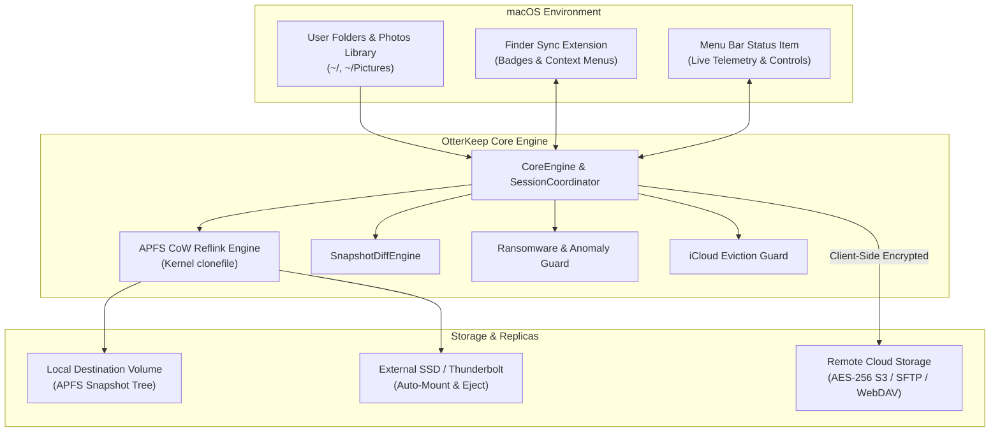

<div align="center">

# OtterKeep 🦦

### Autonomous, APFS-Native Incremental Backup & Replication Engine for macOS

[](https://apple.com/macos)
[](https://swift.org)
[](https://apple.com)
[](LICENSE)
[](https://github.com/richardeszeshu/otter-keep/releases)

<br/>

**„Keep what you love close to your chest.”**  
*„Őrizd a legfontosabb kincseidet biztos kezekben.”*

<br/>

[**Explore User Guides**](docs/userguide/getting-started.md) • 
[**Download v1.3.0**](https://github.com/richardeszeshu/otter-keep/releases) • 
[**Apple Photos Protection**](docs/userguide/photos-protection.md) • 
[**Developer Docs**](docs/dev/architecture.md) • 
[**Brand Guidelines**](docs/BRAND.md)

</div>

---

## 🌊 The Story of OtterKeep (Brand Lore)

> *Sea otters have an extraordinary, instinctive ritual: throughout their entire lives, they carry their most prized favorite pebble tucked securely into a hidden pocket of skin beneath their forearms. They use it to open shells, play with it on the waves, and never let it go under any circumstances.*  
>
> *OtterKeep protects the files, historical snapshots, and precious memories on your Mac with that exact same tender vigilance and devotion.*

---

## ⚡ Why OtterKeep?

Traditional backup solutions on macOS are heavy, slow, and opaque. Full-disk Time Machine bundles are prone to image corruption, while basic rsync scripts duplicate files unnecessarily and break APFS deduplication.

**OtterKeep** is engineered from the ground up for modern macOS:
* **Zero-Cost Reflink Cloning**: Unmodified files take **0 additional bytes** on APFS drives using kernel-level `clonefile()` Copy-on-Write.
* **Multi-Filesystem Driver Engine**: Unified strategy architecture supporting **APFS**, **exFAT** (with 10ms timestamp tolerance), **NTFS** (native source read & read-only pre-flight protection), and legacy FAT.
* **Apple Photos Supercharged**: Full incremental backups for `.photoslibrary` with **iCloud Eviction Guard**—downloading full-res originals temporarily and evicting local cache so your Mac never runs out of disk space.
* **True 3-2-1 Compliance**: Local point-in-time snapshots, external SSD mounts, and client-side encrypted replication to AWS S3, Cloudflare R2, MinIO, SFTP, and WebDAV.
* **Active Ransomware Shield**: Detects suspicious mass file mutations or file deletions and aborts backups before snapshots can be compromised.
* **Interactive Finder Integration**: Right-click any file directly in macOS Finder to inspect chronological versions and restore with one click.

---

## 📊 Feature Comparison Matrix

| Feature | OtterKeep 1.3.0 | Apple Time Machine | Traditional Cloud / Rsync |
|---|:---:|:---:|:---:|
| **Zero-Storage APFS CoW Reflinks** | ✅ **Yes (Kernel Native)** | ⚠️ Limited | ❌ No (Full Copies) |
| **Multi-Filesystem Drivers (exFAT/NTFS)** | ✅ **Yes (Dedicated Drivers)** | ❌ APFS/HFS+ Only | ⚠️ Manual Scripting |
| **Apple Photos Incremental & iCloud Guard** | ✅ **Yes (Full-Res + Evict)** | ❌ Cloud-only skipped | ❌ Broken Bundles |
| **Encrypted 3-2-1 Offsite Replication** | ✅ **S3 / SFTP / WebDAV** | ❌ Local Only | ⚠️ Requires 3rd-party CLI |
| **Ransomware & Anomaly Interceptor** | ✅ **Real-Time Guard** | ❌ No | ❌ No |
| **Snapshot "What Changed?" Diff Engine** | ✅ **Visual GUI & CLI** | ❌ No | ⚠️ Complex Diff Tools |
| **Native macOS Finder Context Menu** | ✅ **Built-In Extension** | ⚠️ Full App Only | ❌ No |
| **Storage Depletion Forecasting** | ✅ **Linear Growth AI** | ❌ Fails when full | ❌ No |
| **Bilingual UI (Hungarian & English)** | ✅ **Native EN & HU** | ⚠️ System Default | ❌ English Only |
| **Open Source (MIT License)** | ✅ **100% Open Source** | ❌ Closed Source | ⚠️ Varies |

---

## 🛠 High-Level Architecture



---

## 🚀 Quick Start Guide

### 1. Installation

#### Homebrew Cask (Recommended)
```bash
brew install --cask richardeszeshu/otterkeep/otterkeep
```

#### Manual Download
1. Download the latest release from [Releases](https://github.com/richardeszeshu/otter-keep/releases).
2. Move `OtterKeep.app` to `/Applications`.
3. Launch OtterKeep and grant **Full Disk Access** when prompted.

---

### 2. Create Your First Backup Profile

1. Open OtterKeep and click **New Profile...**.
2. Select your **Source Folder** (e.g. `~/Documents` or `~/Projects`).
3. Select your **Destination Folder** (e.g. `/Volumes/BackupSSD/OtterVault`).
4. Select a preset:
   - **Developer**: Ignores `node_modules`, `.build`, `.git/objects`, and respects `.gitignore`.
   - **Documents**: Tailored for office files, spreadsheets, and PDFs.
   - **Creative & Media**: Optimized for high-res photography and video assets.
5. Click **Start Backup Now**.

---

### 3. Command Line Interface (CLI)

OtterKeep includes the `otterkeep` CLI tool:

```bash
# Display system diagnostics and permission status
otterkeep doctor

# Run an incremental backup for your active profile
otterkeep backup --profile "Documents"

# Simulate a backup without writing to disk
otterkeep dry-run --profile "Documents"

# Inspect what changed between recent snapshots
otterkeep diff --profile "Documents"

# Trigger an Apple Photos backup
otterkeep photos backup --evict-icloud
```

---

## 📚 Comprehensive Documentation

### 👤 End-User Guides (`docs/userguide/`)
* [**Getting Started & Permissions Setup**](docs/userguide/getting-started.md) — First run, Full Disk Access (FDA), and profile creation.
* [**Backup & Restore Master Guide**](docs/userguide/backup-and-restore.md) — APFS CoW, timeline exploration, QuickLook preview, and restoring files.
* [**Apple Photos Protection Guide**](docs/userguide/photos-protection.md) — Incremental photo backups, iCloud Eviction Guard, and Live Photo pairing.
* [**Remote Destinations & 3-2-1 Replication**](docs/userguide/remote-destinations.md) — Configuring S3, SFTP, WebDAV, AES-256 client encryption, and Zstd compression.
* [**Frequently Asked Questions (FAQ)**](docs/userguide/faq.md) — Troubleshooting, performance optimizations, and security FAQs.

### 💻 Developer Guides (`docs/dev/`)
* [**System Architecture**](docs/dev/architecture.md) — Swift 6 multi-process design, concurrency model, and modular subsystem breakdown.
* [**Storage Engine & Provider Internals**](docs/dev/storage-engine.md) — Low-level APFS `clonefile()` mechanics, fallback providers, and cloud transfer engines.
* [**Database Architecture & Schema Design**](docs/dev/database-design.md) — SQLite manifest catalog, WAL mode, query profiling, and disaster recovery.
* [**Security Hardening & Privacy-Preserving Logging**](docs/dev/security-and-logging.md) — PBKDF2-HMAC-SHA256 client encryption, Keychain credential security, and PII sanitization.
* [**Build, Testing & Packaging Pipeline**](docs/dev/build-and-packaging.md) — Compilation with SPM, 100-test suite execution, and macOS app bundling.
* [**CLI Command Reference**](docs/dev/cli-reference.md) — Full terminal syntax, command flags, and shell automation scripts.
* [**Contributing Guidelines**](docs/dev/contributing.md) — Building from source, testing with `OtterKeepTestRunner`, and code styling.

---

## 🌍 Bilingual Support (HU / EN)

OtterKeep is built from the ground up with first-class **English** and **Hungarian (Magyar)** localization. The interface automatically adapts to your macOS system language, or you can explicitly toggle your preference in **Settings > Language**.

---

## 🛡 Security & Privacy

* **Zero-Knowledge Encryption**: Cloud replicas are encrypted using **AES-256-GCM** before leaving your Mac.
* **Apple Keychain**: All tokens, access keys, and passwords are protected inside the hardware-backed macOS Keychain.
* **Log Sanitization**: Personal file paths, user identities, and sensitive credentials are automatically redacted from diagnostic logs.
* **No Telemetry / No Tracking**: OtterKeep does not phone home, track usage, or sell your data.

---

## 📜 License

OtterKeep is distributed under the **MIT License**. See [LICENSE](LICENSE) for details.

---

<div align="center">
<sub>Crafted with care in Hungary 🇭🇺 • Keep what you love close to your chest.</sub>
</div>
