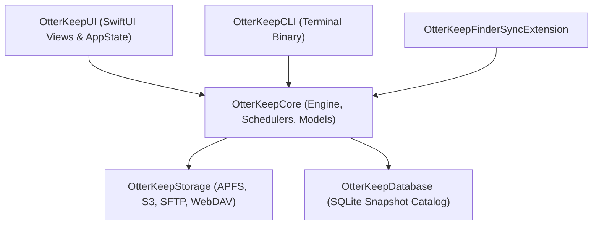

# OtterKeep Technical Architecture

This document provides a comprehensive technical overview of OtterKeep's modular Swift 6 architecture, multi-process coordination, and core subsystems.

---

## 1. System Architecture Overview

OtterKeep is built as a modular macOS application leveraging native Apple system frameworks (AppKit, SwiftUI, APFS, Combine, Swift Concurrency, PhotoKit, and Security).

### Module Breakdown & Subsystem Versions
 
| Module | Version | Responsibility | Key Components |
|---|:---:|---|---|
| `OtterKeepApp` | `1.3.1` | Application lifecycle, Menu Bar item, Sparkle updater | `main.swift`, `MenuBarContentView.swift`, `AppDelegate.swift` |
| `OtterKeepUI` | `1.3.1` | SwiftUI interface, design system, modals, animations, About popup | `AppState.swift`, `OtterTheme.swift`, `MainWindowView.swift`, `OtterAboutView.swift` |
| `OtterKeepCore` | `1.2.1` | Business logic, backup coordination, scheduling, security | `CoreEngine.swift`, `BackupSessionCoordinator.swift`, `RansomwareAnomalyGuard.swift`, `SingleInstanceManager.swift` |
| `OtterKeepStorage` | `1.1.0` | Filesystem drivers (APFS CoW, exFAT, NTFS, FAT), S3/SFTP/WebDAV | `FileSystemDriver.swift`, `FileSystemDriverRegistry.swift`, `APFSDriver.swift`, `ExFATDriver.swift`, `NTFSDriver.swift`, `APFSFileSystemProvider.swift` |
| `OtterKeepDatabase` | `1.1.0` | Snapshot indexing, metadata storage, WAL/TRUNCATE diff engine | `DatabaseEngine.swift`, `SnapshotDiffEngine.swift` |
| `OtterKeepCLI` | `1.1.0` | Native command-line interface & diagnostics | `main.swift` |
| `OtterKeepFinderSync` | `1.0.0` | macOS Finder contextual menu & status badge extension | `OtterKeepFinderSync.swift` |

---

## 2. Process & Concurrency Model

* **Swift 6 Strict Concurrency**: All core managers conform to `Sendable` and use `@MainActor` or thread-safe isolation mechanisms (`NSLock`, Actors, structured concurrency tasks).
* **Single Instance & Locking**: `SingleInstanceManager` and `ProfileExecutionLock` enforce mutual exclusion across CLI and GUI invocations using POSIX file locks and an AF_UNIX local domain socket.
* **Deadlock-Free Process Pipes**: All child process executions (e.g. `mount_smbfs`, `sftp`, `hdiutil`, hooks) employ concurrent `Task.detached` readers to prevent the classic 64 KB POSIX pipe buffer deadlock.
* **Power Management**: Utilizes `IOPMAssertionCreateWithName` during active backup phases to inhibit system idle sleep without preventing display sleep.

---

## 3. Subsystem Deep Dives

* [**Storage Engine & Provider Internals**](storage-engine.md) — Low-level APFS `clonefile()` mechanics, fallback providers, and cloud transfer engines.
* [**Database Architecture & Schema Design**](database-design.md) — SQLite WAL mode, query profiling, entity-relationship diagrams, and disaster recovery.
* [**Security Hardening & Privacy-Preserving Logging**](security-and-logging.md) — PBKDF2-HMAC-SHA256 client encryption, Keychain credential security, and PII sanitization.
* [**Build, Testing & Packaging Pipeline**](build-and-packaging.md) — Compilation with SPM, 100-test suite execution, and macOS app bundling.
* [**CLI Command Reference**](cli-reference.md) — Full terminal syntax, command flags, and shell automation scripts.
* [**Contributing Guidelines**](contributing.md) — Code style, pull request lifecycle, and testing standards.
