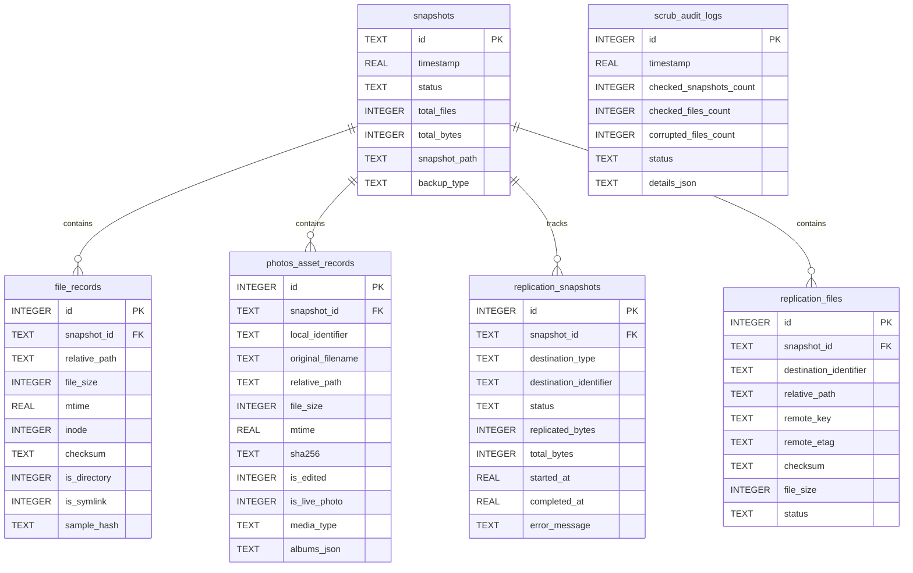

# SQLite Database Architecture & Schema Design

OtterKeep utilizes an embedded SQLite engine for cataloging point-in-time snapshots, historical file revisions, Apple Photos asset metadata, replication ledger state, and data scrubbing audit logs.

The manifest database resides inside each backup destination at `.otterkeep/manifest.sqlite`.

---

## 1. Connection Lifecycle & Concurrency Configuration

The database engine (`DatabaseEngine`) manages SQLite connections with high concurrency and crash resiliency:

```sql
PRAGMA journal_mode = WAL;
PRAGMA synchronous = NORMAL;
PRAGMA foreign_keys = ON;
PRAGMA busy_timeout = 10000;
```

### Key Pragmas & Concurrency Semantics
* **Write-Ahead Logging (WAL)**: Allows readers to execute concurrently with a single writer without locking conflicts.
* **Immediate Transactions**: All write operations execute inside `BEGIN IMMEDIATE TRANSACTION;` blocks, acquiring the database write lock up front to prevent `SQLITE_BUSY` deadlock cascades.
* **Busy Timeout**: 10,000 ms busy timeout ensures that competing processes (e.g., CLI and Menu Bar status daemon) queue gracefully under contention.
* **Query Profiling**: Real-time query profiling flags queries executing over 100 ms as slow-query warnings in diagnostic logs.

---

## 2. Entity-Relationship Diagram



---

## 3. Schema Specifications & Indexes

### `snapshots` Table
Represents each finalized or in-progress point-in-time snapshot.

| Column | Type | Nullable | Description |
|---|---|---|---|
| `id` | `TEXT` | NO | Primary Key (e.g. `snap_2026-10-02_14-30-00`) |
| `timestamp` | `REAL` | NO | Epoch timestamp of snapshot creation |
| `status` | `TEXT` | NO | Status: `in_progress`, `completed`, `completed_with_warnings`, `failed` |
| `total_files` | `INTEGER` | NO | Total file count in snapshot |
| `total_bytes` | `INTEGER` | NO | Aggregated snapshot size in bytes |
| `snapshot_path` | `TEXT` | NO | Relative subpath from destination root (e.g. `snapshot-2026-10-02-143000`) |
| `backup_type` | `TEXT` | NO | `incremental` or `full` |

* **Index**: `idx_snapshots_timestamp` on `snapshots(timestamp DESC)`

---

### `file_records` Table
Stores granular metadata and content fingerprints for each file in a snapshot.

| Column | Type | Nullable | Description |
|---|---|---|---|
| `id` | `INTEGER` | NO | Auto-increment primary key |
| `snapshot_id` | `TEXT` | NO | Foreign Key -> `snapshots(id)` (`ON DELETE CASCADE`) |
| `relative_path` | `TEXT` | NO | Normalized relative path within the backup root |
| `file_size` | `INTEGER` | NO | File size in bytes |
| `mtime` | `REAL` | NO | Modification time epoch |
| `inode` | `INTEGER` | NO | Darwin APFS filesystem inode |
| `checksum` | `TEXT` | YES | Full SHA-256 hex digest |
| `is_directory` | `INTEGER` | NO | Boolean flag (0 = file, 1 = directory) |
| `is_symlink` | `INTEGER` | NO | Boolean flag (0 = regular, 1 = symlink) |
| `sample_hash` | `TEXT` | YES | Fast-hash sparse fingerprint (head + mid + tail) |

* **Indexes**:
  * `idx_file_records_snapshot` on `file_records(snapshot_id)`
  * `idx_file_records_path` on `file_records(relative_path)`

---

### `photos_asset_records` Table
Dedicated index for Apple Photos library assets backed up via PhotoKit.

| Column | Type | Nullable | Description |
|---|---|---|---|
| `id` | `INTEGER` | NO | Auto-increment primary key |
| `snapshot_id` | `TEXT` | NO | Foreign Key -> `snapshots(id)` (`ON DELETE CASCADE`) |
| `local_identifier` | `TEXT` | NO | Apple PhotoKit `PHAsset.localIdentifier` |
| `original_filename` | `TEXT` | NO | Original filename from Apple Photos |
| `relative_path` | `TEXT` | NO | Subpath inside the snapshot (`Photos/YYYY/MM/...`) |
| `file_size` | `INTEGER` | NO | File size in bytes |
| `mtime` | `REAL` | NO | Asset creation or modification date epoch |
| `sha256` | `TEXT` | YES | SHA-256 digest |
| `is_edited` | `INTEGER` | NO | 1 if modified/adjusted, 0 otherwise |
| `is_live_photo` | `INTEGER` | NO | 1 if paired with a Live Photo video track |
| `media_type` | `TEXT` | NO | `image`, `video`, or `audio` |
| `albums_json` | `TEXT` | YES | JSON array of album names containing the asset |

* **Indexes**:
  * `idx_photos_records_snapshot` on `photos_asset_records(snapshot_id)`
  * `idx_photos_records_local_id` on `photos_asset_records(local_identifier)`

---

### `scrub_audit_logs` Table
Maintains history of all silent bit-rot detection sweeps run by `DataScrubberEngine`.

| Column | Type | Nullable | Description |
|---|---|---|---|
| `id` | `INTEGER` | NO | Auto-increment primary key |
| `timestamp` | `REAL` | NO | Sweep execution timestamp |
| `checked_snapshots_count` | `INTEGER` | NO | Count of verified snapshots |
| `checked_files_count` | `INTEGER` | NO | Total files re-checksummed |
| `corrupted_files_count` | `INTEGER` | NO | Count of SHA-256 mismatches detected |
| `status` | `TEXT` | NO | `passed`, `repaired`, `failed` |
| `details_json` | `TEXT` | YES | Granular list of flagged file paths and errors |

* **Index**: `idx_scrub_audit_timestamp` on `scrub_audit_logs(timestamp DESC)`

---

### `replication_snapshots` & `replication_files` Tables
Coordinates offsite 3-2-1 backup copies to cloud object storage (S3, SFTP, WebDAV).

* `replication_snapshots`: Tracks destination state (`s3`, `sftp`, `webdav`), byte transfer progress, and completion timestamps.
* `replication_files`: Maps local relative paths to remote object keys and ETags, allowing multi-destination delta replication without re-uploading identical blobs.
* **Indexes**:
  * `idx_rep_files_lookup` on `replication_files(destination_identifier, relative_path)`
  * `idx_rep_files_snapshot` on `replication_files(snapshot_id)`

---

## 4. Disaster Recovery & Raw Catalog Rebuild

If `manifest.sqlite` is lost, corrupted, or deleted on the destination, OtterKeep automatically triggers a zero-data-loss rebuild:
1. `CatalogRebuildEngine` scans the directory hierarchy of `snapshot-*` folders.
2. Reads filesystem POSIX metadata (`stat`), extended attributes (`xattr`), and recalculates SHA-256 checksums.
3. Reconstructs all tables (`snapshots`, `file_records`, `photos_asset_records`) inside a freshly minted database.
4. Updates the `Latest` symbolic link to point to the newest verified snapshot.
