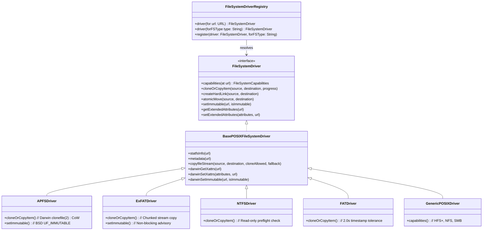

# Storage Engine & Filesystem Driver Internals

OtterKeep v1.3.0 abstracts local and remote storage via a decoupled, driver-oriented architecture (`FileSystemDriver` & `FileSystemDriverRegistry`), enabling transparent switching and optimized I/O across APFS, exFAT, NTFS, FAT, network shares, and cloud object stores.

---

## 1. Filesystem Driver Architecture (`OtterKeepStorage`)

The storage layer implements a Strategy pattern via the `FileSystemDriver` protocol and `FileSystemDriverRegistry`:

### Specialized Drivers

1. **`APFSDriver` (Apple File System)**:
   - Utilizes kernel-level `clonefile(2)` for instantaneous 0-byte block cloning across historical snapshots.
   - Preserves nanosecond timestamp precision, full Darwin extended attributes (`xattrs`), and BSD `UF_IMMUTABLE` file flags.

2. **`ExFATDriver` (Microsoft exFAT)**:
   - Handles flash drives and cross-platform external storage devices.
   - Provides resilient chunked streaming copies via `COPYFILE_DATA | COPYFILE_STAT | COPYFILE_NOFOLLOW`.
   - Incorporates **10ms timestamp tolerance** (`timestampToleranceSeconds = 0.02`) in `ChangeDetector` to prevent false positive delta detections caused by exFAT timestamp rounding.
   - Gracefully manages the absence of POSIX hardlinks, symlinks, and BSD chflags.

3. **`NTFSDriver` (Microsoft NTFS)**:
   - Full differential reading when an NTFS volume serves as the backup source.
   - Pre-flight writeability check blocks target backups on macOS when native read-only mounting is active, throwing localized error `.errNTFSTargetReadOnly`.

4. **`FATDriver` (MS-DOS / FAT32)**:
   - Legacy FAT compatibility with 2.0-second timestamp comparison tolerance.

5. **`GenericPOSIXDriver`**:
   - Universal fallback for HFS+, NFS, SMB, and alternative UNIX mounts.

---

## 2. Remote Replication Providers

OtterKeep supports offsite replication for 3-2-1 compliance:

* **S3 Storage Provider (`S3StorageProvider`)**: Implements AWS Signature Version 4 (`S3Signer`) over URLSession. Supports streaming multipart uploads, custom S3 endpoints (Cloudflare R2, MinIO, Backblaze B2), and Path-Style addressing.
* **SFTP Storage Provider (`SFTPStorageProvider`)**: Handles SSH-2 secure file transfer with both private key and password authentication. Command arguments are sanitized to prevent shell injection, and exit codes are verified.
* **WebDAV Storage Provider (`WebDAVStorageProvider`)**: Connects to Nextcloud, ownCloud, and NAS WebDAV endpoints with atomic chunked uploads complying with RFC 4918.
* **Network Share Mounter (`NetworkShareMounter`)**: Mounts SMB/NFS network shares dynamically via Darwin `mount_smbfs`, storing credentials in the macOS Keychain.
* **Client-Side Encryptor (`ClientSideEncryptor`)**: Employs AES-GCM-256 authenticated encryption with PBKDF2-HMAC-SHA256 (600,000 rounds) key derivation.

---

## 3. SQLite Storage Resilience on Removable Media

When the catalog database is initialized on external or non-POSIX filesystems:
- SQLite `journal_mode = WAL;` is attempted first for high-performance concurrent reads and writes.
- If shared memory locking (`.shm` via `mmap`) is unsupported on the underlying volume (common on certain external flash drives), `DatabaseEngine` automatically falls back to `journal_mode = TRUNCATE;` to ensure transactional safety without crashes.

---

## 4. Data Scrubber & Integrity Verification

The `DataScrubberEngine` and `ChecksumCalculator` continuously verify snapshot integrity:
* Calculates hardware-accelerated SHA-256 checksums using CommonCrypto.
* Detects silent bit-rot on storage media and flags corrupted blocks before they can overwrite healthy backups.
* Records verification results into `scrub_audit_logs` in the SQLite catalog.

---

## 5. WORM Immutability (Write-Once, Read-Many)

To protect historical snapshots against accidental deletion, tampering, or ransomware attacks, OtterKeep applies Darwin POSIX file flags (`chflags`):
* `UF_IMMUTABLE` (0x0002): Prevents file modification, renaming, or deletion even by administrator accounts until explicitly unlocked.
* Snapshot folders on supported filesystems (APFS/HFS+) are marked immutable immediately upon completion, and unlocked only during policy-governed pruning by `RetentionManager`.
