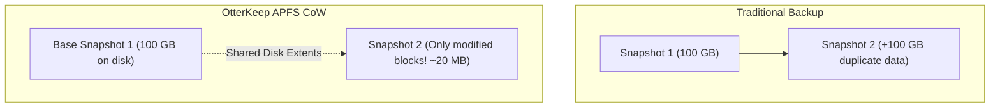
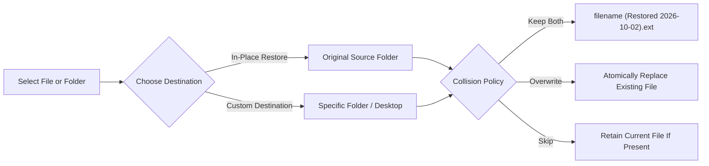

# Backup & Restore Guide

OtterKeep harnesses the low-level superpowers of the Apple File System (APFS). This guide explains how OtterKeep's Copy-on-Write (CoW) snapshot engine works, how to inspect file history over time, and how to restore lost or damaged data with surgical precision.

---

## 1. The APFS Copy-on-Write (CoW) Advantage

Traditional backup utilities create redundant copies of unmodified files or bundle them into proprietary, opaque archives. OtterKeep takes a fundamentally different, modern macOS approach:



### How Reflink Cloning Works
* When you initiate a backup on an APFS volume, OtterKeep uses Apple's native `clonefile()` system call.
* Unmodified files are converted into **reflinks** (APFS block clones). They share the exact physical data blocks with previous snapshots on your drive.
* **Storage consumption for unchanged files is strictly 0 bytes.**
* When you subsequently modify or delete a file in your source folder, only the newly written blocks occupy disk space.
* Every snapshot remains a **100% complete, fully traversable folder tree** in the Finder, without requiring slow extraction or reassembly steps.

### Multi-Filesystem Support (exFAT & NTFS)
* **exFAT Drives**: When backing up to external exFAT drives, OtterKeep automatically switches to high-speed stream copying with metadata preservation. A 10ms timestamp tolerance is applied so files are not marked as changed due to exFAT timestamp rounding.
* **NTFS Drives**: Fully supported as backup sources. When an NTFS drive is selected as a destination, OtterKeep checks writeability upfront and provides clear warnings if macOS has mounted the drive in read-only mode.

---

## 2. Navigating the Restore Explorer

To explore historical versions of your files:
1. Open OtterKeep and select your backup profile.
2. Click the **Time Machine & Restore** tab in the main navigation.
3. Choose your view mode:
   - **Snapshot Mode**: View the complete file tree exactly as it existed at a specific backup point in time.
   - **Timeline Mode**: Focus on an individual file or directory and see a chronological log of every recorded version.
   - **What Changed? (Diff Mode)**: Side-by-side delta comparison of additions, deletions, and modifications between any two snapshots.

```
┌────────────────────────────────────────────────────────────────────────┐
│ Snapshot: 2026-10-02 18:30:00 (14,210 files • 84.2 GB • APFS CoW)      │
├───────────────────────────────┬────────────────────────────────────────┤
│ 📁 Documents                  │ Selected File: Final_Report.pdf        │
│   📁 Q3_Reports               │ Version: 2026-10-02 18:30:00 (v3)      │
│     📄 Final_Report.pdf ◄───  │ Size: 4.2 MB                           │
│     📄 Financials.xlsx        │ SHA-256: e3b0c44298fc1c149afbf4...     │
│   📁 Research                 │ Status: [APFS Reflink Cloned]          │
│ 📁 Projects                   │                                        │
│   📁 OtterKeep                │ [ Preview (Space) ] [ Restore Version ]│
└───────────────────────────────┴────────────────────────────────────────┘
```

### QuickLook Inspection
Just like in the macOS Finder, you can select any file in OtterKeep's tree view and press the **Spacebar** to trigger macOS **QuickLook**. Instantly preview PDF documents, high-resolution images, video clips, source code, and Keynote presentations directly from your backup history without restoring them first.

---

## 3. "What Changed?" — Snapshot Diff Engine

Before restoring or after running a scheduled sync, you often want to know what changed between two points in time.

1. Navigate to the **What Changed?** tab in the Restore Explorer.
2. Select your **Target Snapshot** and a **Base Snapshot** (or compare with the directly preceding snapshot).
3. The diff engine classifies changes into 4 interactive tabs:
   * **All Changes**: Aggregated summary and net storage footprint delta (+/- MB).
   * **Added (Green)**: New files created since the base snapshot.
   * **Modified (Amber)**: Files whose content or metadata changed.
   * **Deleted (Red)**: Files that existed in the base snapshot but were removed.
4. Click any modified file to view exact byte deltas and timestamp changes.

---

## 4. Restoring Files and Folders

OtterKeep provides surgical restoration options tailored to your workflow:



### Option A: In-Place Restore
Restores the selected file or directory back to its original location in your source directory.

1. Click **Restore Version**.
2. Select **Restore to Original Location**.
3. Pick your **Collision Resolution Policy**:
   * **Keep Both (Recommended)**: Renames the restored file with a timestamp suffix (e.g., `Budget (Restored 2026-10-02).xlsx`), safeguarding existing work from being overwritten.
   * **Overwrite**: Atomically replaces the current version on disk with the restored version.
   * **Skip**: If a file with the same name already exists in the destination, skipping avoids modifications.
4. Click **Confirm Restore**.

### Option B: Restore to Custom Folder
1. Click **Restore to Folder...**
2. Browse and select any folder (such as `~/Desktop` or an external USB stick).
3. OtterKeep writes the restored files into the designated directory immediately.

---

## 5. Finder Context Menu Integration

You can restore older versions of files directly from the native macOS **Finder**:

1. Right-click (or Control-click) any file inside a monitored backup folder.
2. Select **OtterKeep: Browse File History...** from the contextual menu.
3. A floating version history sheet will appear over your Finder window, showing:
   * Every historical backup that includes this file.
   * Timestamp, file size, and cryptographic SHA-256 hash.
   * One-click **Restore** or **Preview** buttons.

---

## 6. Retention Policies & Auto-Pruning

Over time, snapshots accumulate on your backup volume. OtterKeep helps you manage storage without losing critical points in history:

* **Keep Last N Snapshots**: Configure your profile to retain the last 30, 60, or 90 snapshots. Older snapshots are safely pruned.
* **Storage Forecast & Quota Alerts**: OtterKeep constantly measures daily data churn and warns you weeks before your destination drive fills up.
* **Manual Consolidation**: In **Storage & Maintenance**, you can click **Prune Older Snapshots** or rebuild the local metadata catalog at any time.
