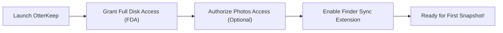
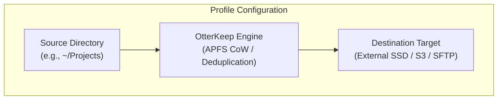

# Getting Started with OtterKeep

Welcome to **OtterKeep**, the autonomous, APFS-native incremental backup and replication engine crafted exclusively for macOS.

Inspired by sea otters who safeguard their most precious pebble tucked securely beneath their forearms, OtterKeep keeps what you love close to your chest—protecting your files, snapshots, and Apple Photos with cryptographic security and zero-cost Copy-on-Write efficiency.

---

## System Requirements

| Specification | Requirement | Recommended |
|---|---|---|
| **Operating System** | macOS 14.0 Sonoma or later | macOS 15.0 Sequoia or later |
| **Architecture** | Apple Silicon (M1/M2/M3/M4) or Intel x86_64 | Apple Silicon (Native arm64) |
| **File System** | Primary: APFS (Apple File System) | Destination: APFS (SSD/HDD) or S3/SFTP/WebDAV |
| **Permissions** | Full Disk Access (FDA), Photos Access | Background Daemon + Finder Sync Extension |

---

## 1. Installation

You can install OtterKeep either via Homebrew Cask or via direct standalone DMG/Zip download.

### Option A: Homebrew Cask (Recommended)

Run the following command in Terminal:

```bash
brew install --cask richardeszes/tap/otterkeep
```

### Option B: Standalone Application Bundle

1. Download the latest release (`OtterKeep-1.0.0.zip` or `.dmg`) from the [Official Releases](https://github.com/richardeszes/OtterKeep/releases).
2. Open the downloaded archive and drag **OtterKeep.app** into your `/Applications` folder.
3. Launch OtterKeep from Launchpad, Spotlight, or Finder.

```bash
# If prompted about macOS Gatekeeper quarantine on first manual launch:
xattr -rd com.apple.quarantine /Applications/OtterKeep.app
```

---

## 2. Essential Permissions Setup

Because macOS protects personal user data (such as Documents, Desktop, Downloads, and system containers) through Transparency, Consent, and Control (TCC), OtterKeep requires explicit authorization to guarantee complete and uncorrupted backups.



### A. Full Disk Access (FDA)

> [!IMPORTANT]
> Without Full Disk Access, macOS prevents backup tools from reading locked application containers, Mail databases, Safari bookmarks, and protected user folders.

1. Open **System Settings** (`⌘ + ,`).
2. Navigate to **Privacy & Security** > **Full Disk Access**.
3. Click the **+** (Add) button and select `/Applications/OtterKeep.app`.
4. Ensure the toggle switch next to **OtterKeep** is **ON** (active).
5. Alternatively, in OtterKeep, navigate to **Settings** > **System Permission Status** and click **Grant Full Disk Access** for one-click access.

### B. Apple Photos Authorization (If using Photos Sync)

When you first open the **Photos Workspace** tab in OtterKeep:
1. macOS will present a system prompt requesting Photos Library access.
2. Select **Allow Full Access**.
3. If missed, enable it anytime in **System Settings** > **Privacy & Security** > **Photos** > **OtterKeep**.

### C. Finder Sync Extension

OtterKeep includes an integrated macOS Finder extension that displays visual backup status badges and adds contextual right-click menu items (*"Restore Previous Versions with OtterKeep"*).

1. Open **System Settings** > **Privacy & Security** > **Extensions** > **Added Extensions**.
2. Locate **OtterKeep** and check the box to enable the Finder Sync extension.
3. In OtterKeep Settings, click **Restart Finder** to apply immediately.

---

## 3. Creating Your First Backup Profile

OtterKeep organizes your backup targets into independent, configurable **Profiles**. Each profile pairs a source directory with a destination target and custom retention rules.



1. Launch OtterKeep. On the primary window, click the **"+"** button or select **New Profile...** from the profiles menu.
2. Enter a descriptive name (e.g. `Work Projects`, `Personal Vault`, or `Creative Assets`).
3. Select your **Source Folder** (the directory you wish to protect).
4. Select your **Destination Folder** (an external APFS drive, secondary partition, or network mount).
5. Choose a **Preset**:
   - **Developer Preset**: Automatically excludes `node_modules`, `.build`, `.git/objects`, `Pods`, and honors local `.gitignore` rules.
   - **Documents Preset**: Tailored for office files, PDFs, spreadsheets, and personal records.
   - **Creative & Media Preset**: Optimized for high-resolution images, RAW files, and video project libraries with fast SmartHash integrity checks.
6. Click **Create Profile**.

---

## 4. Running Your First Backup

1. Select your newly created profile in the sidebar.
2. *(Recommended)* Click **Dry Run** to execute a non-destructive simulation. OtterKeep scans your source folder, calculates the required storage space, and displays exactly how many files will be backed up.
3. Click **Start Backup Now**.
4. Watch the real-time **Pipeline Telemetry**:
   - **Scanning**: Discovers directories and computes change deltas.
   - **Copying & Reflink**: Uses APFS Copy-on-Write (`clonefile`) for instant, zero-byte intra-volume clones, or streams new blocks to your external drive.
   - **Finalizing**: Seals the point-in-time immutable snapshot in the local SQLite catalog.
5. Once complete, you will receive a macOS system notification, and the dashboard will turn vibrant oceanic teal!

---

## 5. Automation & Background Daemon

Never worry about manually remembering to back up again:

* **Schedule**: Under **Rules & Scheduling**, enable **Automatic Backup Schedule**. Choose from Hourly, Daily at a specific hour, Weekly, or every 15/30/60 minutes.
* **Volume Mount Automation**: Toggle **Backup on Volume Mount**. Whenever you plug in your external backup SSD or dock at your desk, OtterKeep automatically triggers the backup in the background.
* **Auto-Eject**: Check **Auto-Eject on Completion** to have OtterKeep cleanly unmount your external drive once the backup is safely committed.
* **Launch at Login**: Enable in **Settings** > **Launch at Login** so OtterKeep's lightweight menu bar daemon stays active silently.

---

## Next Steps

- Explore [APFS Backup & Restore Guide](backup-and-restore.md) to master time machine browsing, diff comparisons, and file recovery.
- Set up Apple Photos protection with [Apple Photos Protection Guide](photos-protection.md).
- Follow the 3-2-1 rule by reading [Remote Destinations & Cloud Replication](remote-destinations.md).
- Have questions? Check the [Frequently Asked Questions (FAQ)](faq.md).
