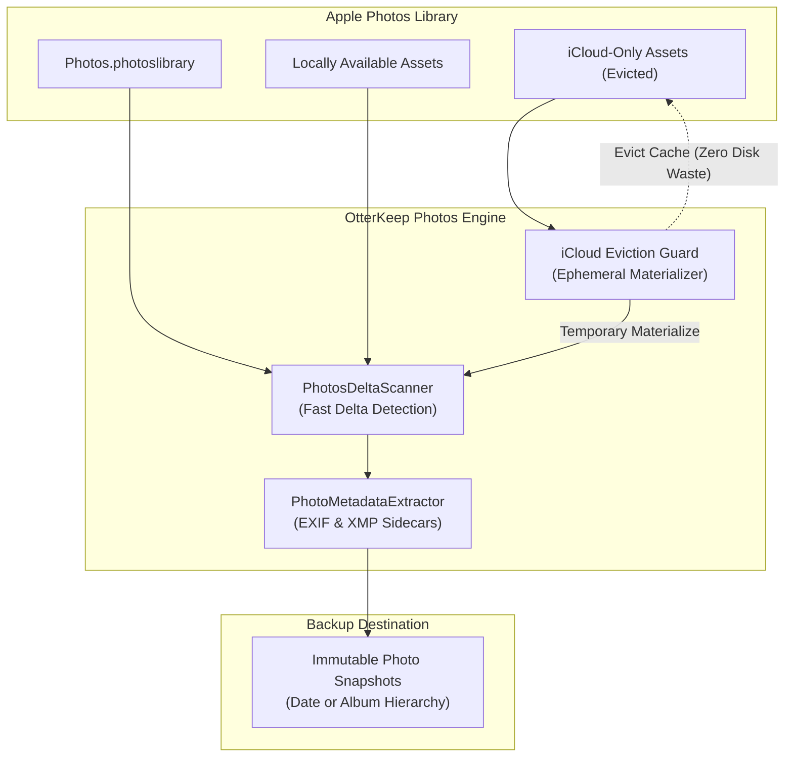

# Apple Photos Protection & iCloud Guard

Your Apple Photos Library contains a lifetime of irreplaceable moments—family celebrations, vacations, creative work, and milestone memories. However, backing up modern macOS Photos libraries has historically been frustrating due to Apple's opaque `.photoslibrary` bundle format and iCloud Photos "Optimize Mac Storage" offloading.

OtterKeep solves both challenges with an Apple-native Photos engine designed for speed, completeness, and disk safety.

---

## 1. The Challenges of Backing Up Apple Photos

1. **Opaque Bundle Architecture**: Standard backup utilities struggle with the internal SQLite database locks, proprietary file hashes, and symlinks inside `Photos Library.photoslibrary`.
2. **The "Optimize Mac Storage" Trap**: If you use iCloud Photos with disk optimization enabled, full-resolution RAWs and 4K videos are frequently evicted from your local Mac SSD, leaving only lightweight thumbnails. Most backup tools simply skip these cloud-only files, resulting in incomplete backups!
3. **Live Photos & Edits**: Live Photos consist of a paired still image and a QuickTime video asset. Separating them breaks motion and sound playback.

---

## 2. OtterKeep's Photos Architecture

---

## 3. iCloud Eviction Guard Explained

OtterKeep features an **Ephemeral Storage Guard** and **iCloud Eviction Controller**:

* **On-Demand Materialization**: When OtterKeep encounters an asset stored exclusively in iCloud, it requests a temporary, high-speed download through Apple's native PhotoKit and CloudKit framework.
* **Safe Staging**: The file is streamed into an ephemeral buffer on your drive.
* **Reflink / Secure Copy**: The full-fidelity asset is committed to your backup destination.
* **Intelligent Eviction**: Once the file is secured, OtterKeep requests macOS to immediately purge the local cache for that asset.
* **Result**: **Your backup destination holds 100% full-resolution originals**, while your Mac's internal SSD never runs out of space!

> [!TIP]
> You can toggle the iCloud Strategy between:
> - **Download and Evict (Recommended)**: Backs up full-resolution originals without consuming local disk space.
> - **Metadata Only**: Backs up only local thumbnails and metadata if bandwidth is restricted.

---

## 4. Organizing Your Export Structure

In **Photos Settings**, choose how OtterKeep arranges your backed-up photos on your destination drive:

| Structure Type | Organization Example | Best For |
|---|---|---|
| **Date Hierarchy (Default)** | `/2026/10/2026-10-02_14-30-22_IMG_4096.HEIC` | Chronological photo archives and timeline sorting |
| **Album Hierarchy** | `/Summer Vacation 2026/IMG_4096.HEIC` | Preserving custom curated Apple Photos albums |
| **Flat Archive** | `/Photos_Master/IMG_4096.HEIC` | Batch ingestion into photography catalogs (Lightroom/Capture One) |

### Key Features
* **Include Live Photo Companion Movies**: Backs up paired `.MOV` files alongside `.HEIC`/`.JPG` images so Live Photo animation is preserved forever.
* **Export Edited & Original Versions**: Backs up original sensor RAWs as well as non-destructive edits and crops applied in Apple Photos.
* **Generate XMP Sidecars**: Automatically generates standard XML sidecars (`IMG_4096.xmp`) containing captions, keywords, face tags, and GPS coordinates for universal compatibility with third-party software.

---

## 5. Setting Up Your Photos Backup

1. Open OtterKeep and select the **Apple Photos** tab in the sidebar.
2. Grant **Full Photos Access** when prompted by macOS.
3. Review your **Library Overview**:
   * Total Asset Count (Images, Videos, Live Photos).
   * Local vs. iCloud-Only Asset breakdown.
   * Total Library footprint.
4. Select your **Destination Drive** (such as an external APFS SSD or S3 Cloud bucket).
5. Configure your preferred **Folder Structure** and **iCloud Eviction** preference.
6. Click **Start Photos Backup**.

---

## 6. Incremental Delta Scanning

Backing up 50,000 photos could take hours with traditional tools. OtterKeep's **PhotosDeltaScanner** maintains a high-speed SQLite index of previously backed-up asset UUIDs and modification timestamps. Subsequent backups complete in **mere seconds**, only transferring newly captured or edited photos!
